# Expense Tracker Mobile Application

---

 The Expense Tracker application is a basic mobile app that allows the user to log their expenses. The App has two main screens. The first screen shows recent expenses within the last 7 days. The second screen shows all the expenses.

### Technologies:

- React Native
- Expo
- Firebase

### Screenshots:

#### iPhone

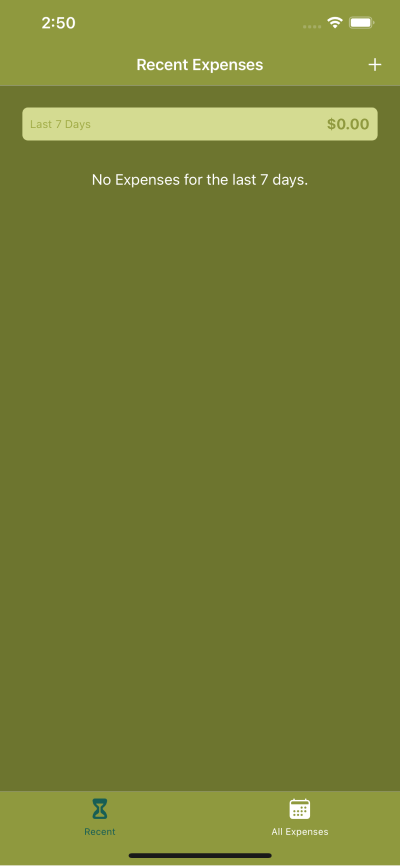
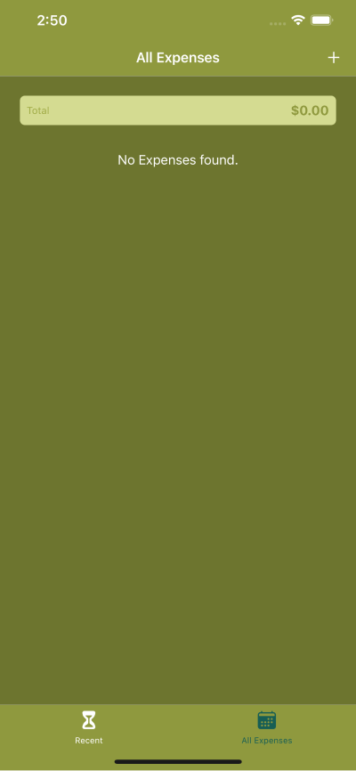

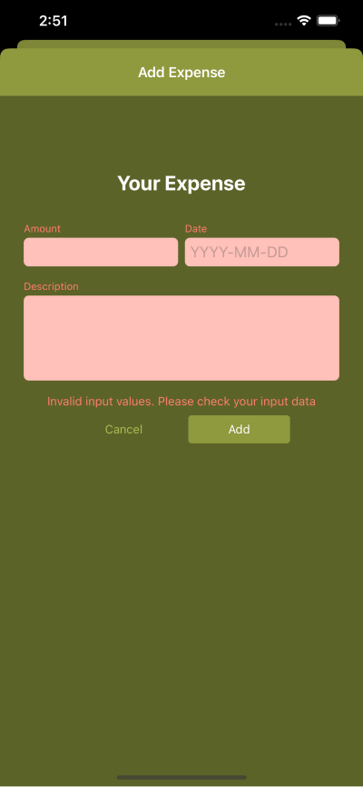
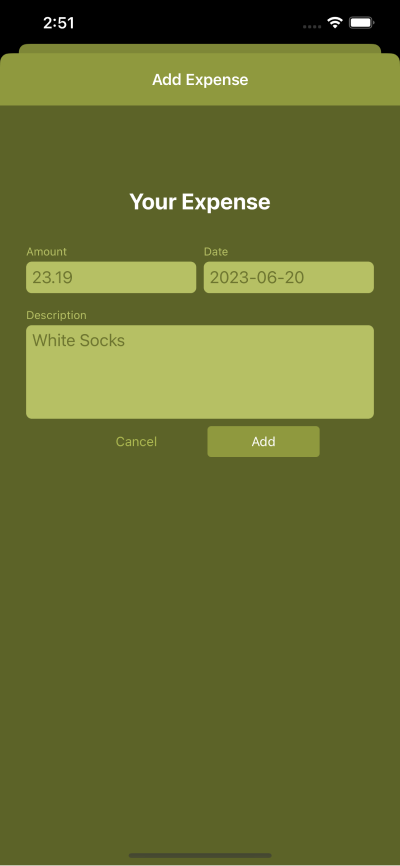
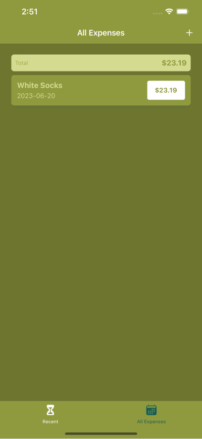
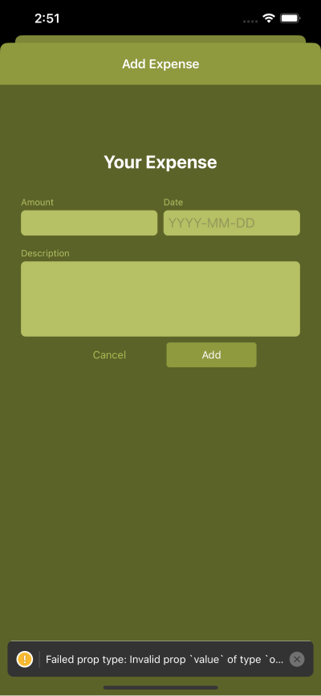
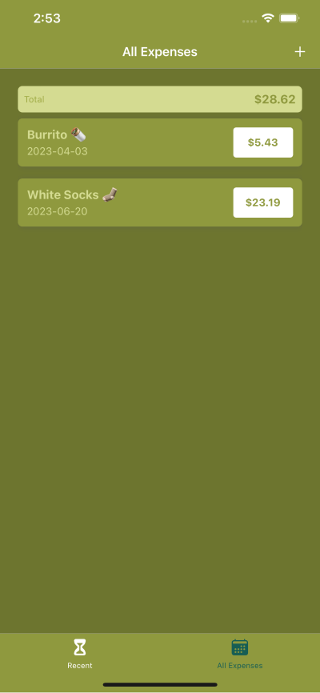
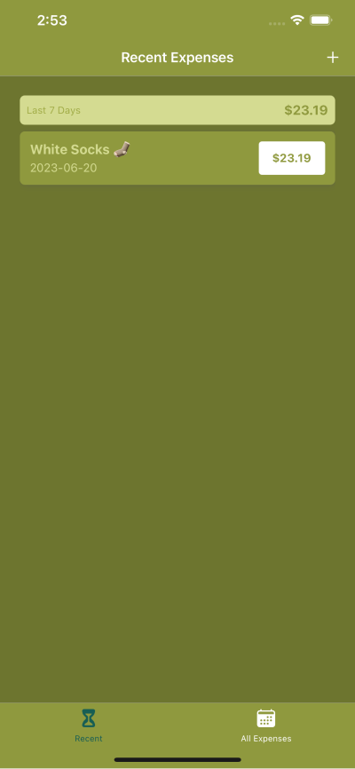
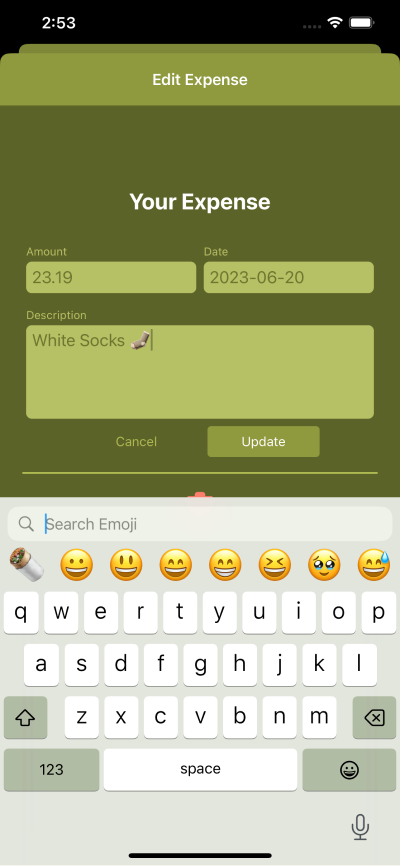

#### Android
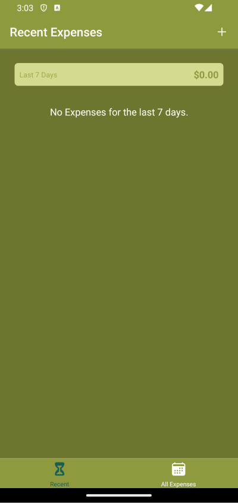
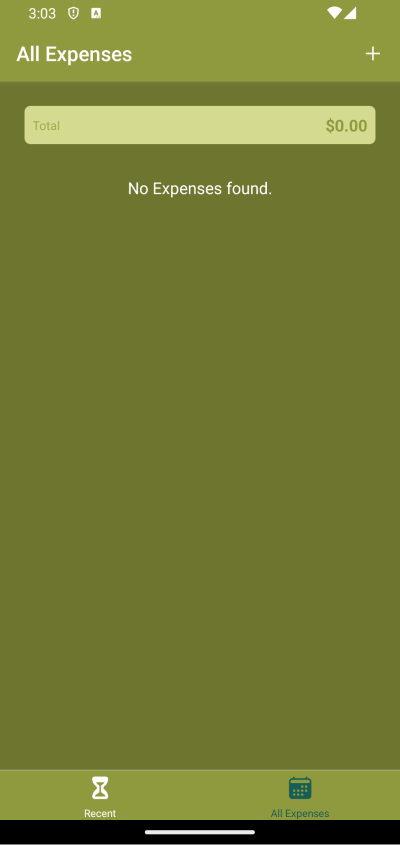
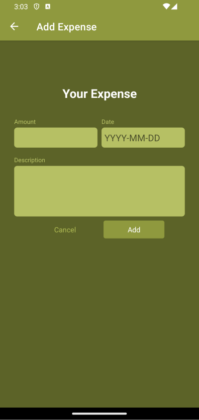
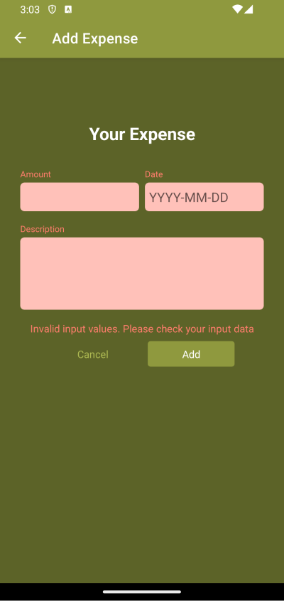
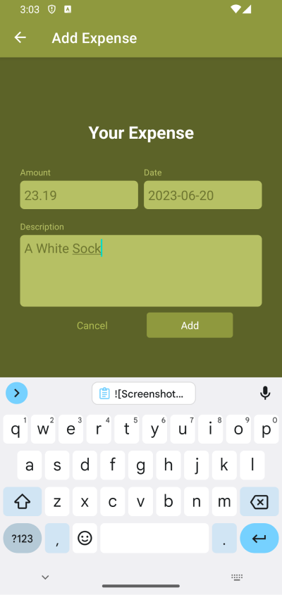
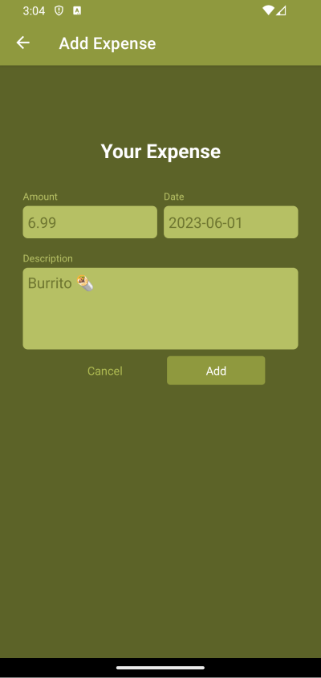